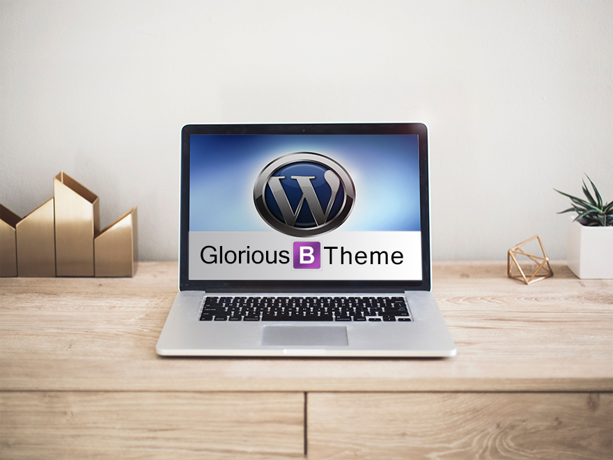

# Glorious starter Developer Framework

## Prerequisites

This theme relies on **NPM** and **Composer** in order to load dependencies and packages.
**Gulp** should always be running and watching during the development process, in order to properly compile and update files.

* Install [Composer](https://getcomposer.org/)
* Install [Node](https://nodejs.org/)
* Install [Gulp](http://gulpjs.com/)

## Installation

* Move the `.env.example` to your WordPress root directory, rename it as `.env`, and setup your website variables
* Move the `wp-config.example.php` to your WordPress root directory and rename it as `wp-config.php`, to replace the default one
* Open a Terminal window on the location of the theme folder
* Execute `composer install`
* Execute `npm install`

## Gulp

* Run `npm run gulp` at the beginning of every development session to run and watch files for changes
* This will compile you files into the public folder ready for production deployment.
* ONLY CHANGE FILES situated inside the assets folder. Here you will find Javascript and sass files. Your personal added Javascript can be added to the genious.js file. All sass files are imported into the index.scss file

```
> install wordpress
> cd into wp-content/themes then ...
> git clone https://github.com/jwill9999/glorious.git
> cd glorious
> npm install
> move the example files ".composer-example.json" , ".wp-config-example.php", and ".env.example" to the root of your WORDPRESS folder. Remove the word example and amend as required.
> install composer in root wordpress folder structure by running ...
> php composer.phar install

> cd back into your Genious theme folder ...
> cd ./wp-content/themes/glorious
> to start server and to watch for file changes run
> npm run gulp
```

## Project View



# Glorious Starter Development Framework Wordpress

This is a developer theme based on Underscore It incorporates Bootstrap 4 and jQuery. Environmental variables and managed safely using the DotEnv package.
The development server uses auto browser refreshing as well as gulp to compile your sass files and to watch for file structure changes. You can also use the latest ES6/7 javascript language within your javascript files.

<hr>

# Key features

> Glorious Wordpress developer theme

> Gulp task runner

> Browser-sync for live reloading in development

> Sass CSS compilation

> Uses Underscore Base theme

> Bootstrap 4

> The latest jQuery library

> Normalizer.js

> CDN delivered core assets

> HTML5 Ready

> Use Global Environmental Variables for easy wp-configuration.

> Uses DotEnv

... to name a few

<hr>

# Links

[Underscore base theme](https://underscores.me/)

[Bootstrap 4](https://getbootstrap.com/)

[getComposer](https://getcomposer.org/)

[Composer Packages](https://packagist.org/)

[DotEnv package required ](https://packagist.org/packages/vlucas/phpdotenv)

[Uses Normaize css](https://github.com/necolas/normalize.css/)

This project was generated with [Underscore.io](https://underscores.me/), [Bootstrap 4](https://getbootstrap.com/), as well as [vlucas/phpdotenv](https://packagist.org/packages/vlucas/phpdotenv)

<hr>
